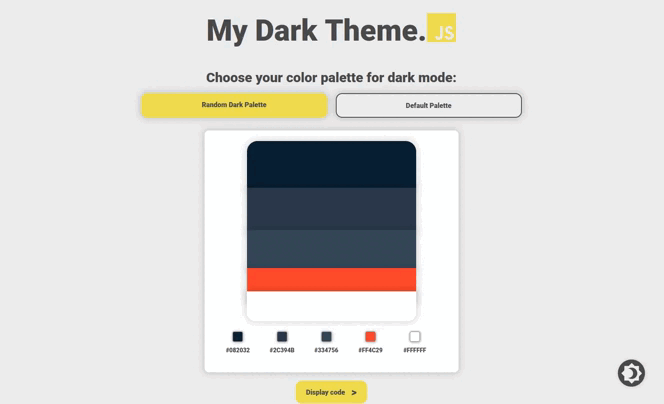

<h1 align="center">
   
  
   
My Dark Theme.JS   
</h1>
<h4 align="center">Generate a button for your site to transform it into dark mode that you will have personalized !</h4>
 

## WEB version 🌐

Le site est en live ici 👉 [My Dark Theme.JS](https://javascriptexercice.herokuapp.com/)

## Technologies utilisées ⚙️

Pour ce programme les technologies suivantes ont été utilisé :  

 
 
Le site est responsive.

## Crédit 🔗
[Guillaume Reygner](https://github.com/guillaume-rygn)

